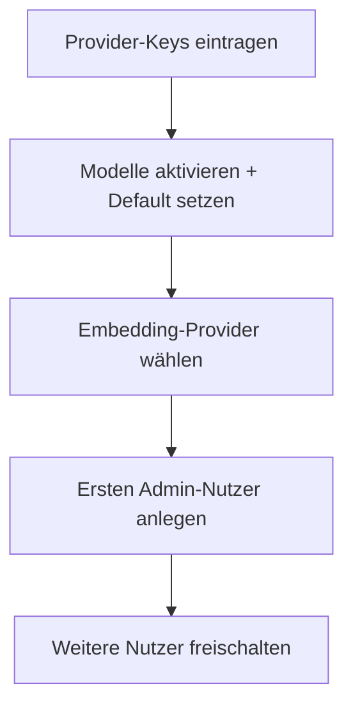
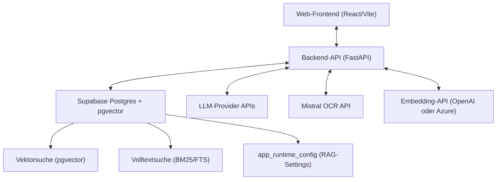

# Admin-Dokumentation

Stand: 22.02.2026
Produkt: **XQT5 AI Plattform**

## 1. Ziel dieser Dokumentation

Diese Dokumentation richtet sich an Plattform-Administratoren. Sie beschreibt alle
administrativen Funktionen, die Erstkonfiguration und die laufende Governance der Plattform.

Für Endnutzer-Funktionen (Chat, Dokumente, Pools) gilt zusätzlich die [Anwender-Dokumentation](./ANWENDER-DOKUMENT.md).

---

## 2. Rollen

- **User**: Chat, eigene Dokumente, Assistenten, Templates, Pools nutzen
- **Admin**: alle User-Rechte plus Zugriff auf das Admin-Dashboard

Admin-Rechte werden im Admin-Dashboard unter **Benutzer** gesetzt.

---

## 3. Admin-Dashboard — Übersicht

Das Admin-Dashboard ist über den Link im Navigationsbereich erreichbar (nur für Admins sichtbar).
Es gliedert sich in folgende Tabs:

| Tab | Inhalt |
|-----|--------|
| Übersicht | Systemstatistiken, aktive Nutzer, Dokumentanzahl |
| Benutzer | Nutzerverwaltung, Rollen, Aktivierung |
| Modelle | Modellkatalog, Default-Modell, Aktivierung |
| Provider | API-Keys verwalten, Endpoint-Konfiguration |
| Retrieval | RAG-Einstellungen, Embedding-Provider, Rechunking |
| Kosten | Nutzungsauswertung nach Modell und Provider |
| Audit | Audit-Log aller administrativen Aktionen |

---

## 4. Erstkonfiguration

### 4.1 Provider-Keys einrichten

Ohne konfigurierte API-Keys können keine Modelle genutzt werden.

1. Admin-Dashboard öffnen → Tab **Provider**
2. Für jeden Provider (z. B. OpenAI, Anthropic, Azure OpenAI, Mistral) den API-Key eintragen
3. Bei Azure OpenAI zusätzlich: Endpoint-URL und API-Version eintragen
4. **Testen**-Button nutzen, um die Verbindung zu prüfen

Benötigte Keys je Funktion:

| Funktion | Benötigter Key |
|----------|----------------|
| Chat (OpenAI-Modelle) | OpenAI |
| Chat (Anthropic-Modelle) | Anthropic |
| Chat (Azure-Modelle) | Azure OpenAI |
| Chat (Google-Modelle) | Google |
| Chat (Mistral-Modelle) | Mistral |
| Chat (xAI-Modelle) | xAI |
| Embeddings (Standard) | OpenAI |
| Embeddings (Azure) | Azure OpenAI |
| OCR (PDF/Bild-Dokumente) | Mistral |
| Automatische Zusammenfassung | je nach Default-Modell |

### 4.2 Modelle aktivieren

1. Tab **Modelle** öffnen
2. Gewünschte Modelle aktivieren (Schalter)
3. Default-Modell festlegen (wird für Auto-Zusammenfassung und Auto-Titel genutzt)

### 4.3 Embedding-Provider wählen

1. Tab **Retrieval** öffnen
2. **Embedding-Provider** auswählen:
   - **OpenAI** (Standard): nutzt `text-embedding-3-small` über die OpenAI REST API
   - **Azure OpenAI**: nutzt ein Azure-Deployment über die Azure OpenAI REST API
3. Bei Azure: **Deployment-Name** des Embedding-Modells eintragen (z. B. `text-embedding-3-small-deploy`)
4. Speichern

> **Hinweis**: Endpoint, API-Key und API-Version für Azure werden aus der Provider-Konfiguration übernommen (Tab Provider). Es genügt, den Deployment-Namen einzutragen.

### 4.4 Neue Benutzer freischalten

Neu registrierte Nutzer sind standardmäßig inaktiv.

1. Tab **Benutzer** öffnen
2. Nutzer suchen
3. **Aktivieren** (Schalter) und ggf. Admin-Rechte vergeben

---

## 5. Laufender Betrieb

### 5.1 Nutzerverwaltung

- Nutzer aktivieren / deaktivieren (bei Deaktivierung werden alle aktiven Sessions sofort ungültig)
- Admin-Rechte vergeben / entziehen
- Übersicht aller registrierten Nutzer

### 5.2 Nutzungs- und Kostenauswertung

Tab **Kosten** zeigt:

- Tokenverbrauch und Kosten pro Modell und Provider (aufgeschlüsselt)
- Zeitraum-Filter (Tag, Woche, Monat, gesamt)
- Aufschlüsselung nach Nutzer

> Embeddings werden separat nach Provider ausgewiesen (z. B. "OpenAI Embeddings" vs. "Azure OpenAI Embeddings").

### 5.3 Audit-Log

Tab **Audit** protokolliert alle administrativen Aktionen:

- Nutzeranmeldungen
- Änderungen an Modellen, Providern und RAG-Einstellungen
- Dokumenten-Uploads und -Löschungen
- Pool-Aktionen

### 5.4 Reranking konfigurieren (optional)

Im Tab **Retrieval** kann Reranking aktiviert werden:

- **Reranking aktivieren**: nach dem initialen Retrieval werden Chunks durch ein Reranking-Modell neu gewichtet
- **Reranking-Kandidaten**: wie viele Chunks initial abgerufen werden (Standard: 20)
- **Reranking Top-N**: wie viele Chunks nach dem Reranking im Kontext verbleiben (Standard: 6)
- **Reranking-Modell**: Cohere-Modell (Standard: `rerank-v3.5`)

---

## 6. Dokumente verwalten

### 6.1 Rechunking

Nach Änderungen an der Chunking-Strategie oder nach Plattform-Updates können vorhandene
Dokumente neu verarbeitet werden:

1. Tab **Retrieval** öffnen
2. **Dokumente neu chunken** klicken
3. Status wird live angezeigt (Fortschritt + Fehlerzähler)

> Rechunking ist notwendig, damit:
> - Seitenzahlen in Zitaten für ältere Dokumente erscheinen
> - neue Chunking-Parameter (Größe, Overlap) wirksam werden
> - BM25-Indizes nach Schema-Änderungen aktualisiert werden

### 6.2 Datenbankmigrationen

Bei Updates der Plattform können SQL-Migrationen erforderlich sein. Diese werden im
Supabase SQL Editor ausgeführt. Aktuelle Migrationen befinden sich unter `supabase/migrations/`.

Relevante Migrationen (RAGplus):

| Datei | Zweck |
|-------|-------|
| `20260221_rag_scoped_search.sql` | pgvector RPCs für Hybrid-Suche |
| `20260222_bm25_fts.sql` | BM25/FTS-Index auf Chunks |
| `20260223_chunk_page_number.sql` | Seitenzahl-Spalte in `app_document_chunks` |
| `20260224_embedding_provider_setting.sql` | Embedding-Provider-Felder in `app_runtime_config` |
| `20260225_document_summary.sql` | Summary-Spalte in `app_documents` |

---

## 7. Typische Admin-Workflows

### 7.1 Plattform-Ersteinrichtung

1. Provider-Keys für alle genutzten Provider eintragen und testen
2. Modelle aktivieren, Default-Modell festlegen
3. Embedding-Provider wählen (OpenAI oder Azure OpenAI)
4. Ersten Nutzer registrieren und in Benutzer-Tab aktivieren + Admin-Rechte vergeben
5. Weitere Nutzer nach Bedarf freischalten

### 7.2 Neuen Nutzer onboarden

1. Nutzer registriert sich selbst über die Plattform
2. Admin öffnet Tab **Benutzer**
3. Nutzer aktivieren, ggf. Admin-Rechte vergeben
4. Nutzer kann sich einloggen

### 7.3 Provider wechseln (z. B. zu Azure OpenAI)

1. Tab **Provider**: Azure-OpenAI-Key + Endpoint eintragen und testen
2. Tab **Modelle**: Azure-Modelle aktivieren, ggf. als Default setzen
3. Tab **Retrieval**: Embedding-Provider auf "Azure OpenAI" umstellen, Deployment-Name eintragen
4. Speichern
5. Optional: Dokumente neu chunken, damit neue Embeddings generiert werden

### 7.4 Nach Plattform-Update

1. SQL-Migrationen aus `supabase/migrations/` im Supabase SQL Editor ausführen
2. Backend deployen
3. Frontend deployen
4. Ggf. Rechunking anstoßen (Tab Retrieval → "Dokumente neu chunken")

---

## 8. Architektur (Admin-Sicht)

### Wichtige Tabellen

| Tabelle | Inhalt |
|---------|--------|
| `app_users` | Nutzerkonten, Rollen, aktiv/inaktiv |
| `app_documents` | hochgeladene Dokumente, Status, Zusammenfassung |
| `app_document_chunks` | Chunks mit Embeddings, Seitenzahl, FTS-Vektor |
| `app_model_config` | Modellkatalog, aktive Modelle, Default |
| `app_provider_keys` | verschlüsselte API-Keys |
| `app_runtime_config` | RAG-Einstellungen (JSON), Embedding-Provider |
| `app_audit_logs` | Admin-Audit-Trail |
| `app_token_usage` / `chat_token_usage` | Nutzungs- und Kostendaten |
| `pool_pools` | Pools |
| `pool_members` | Pool-Mitglieder mit Rollen |
| `pool_invite_links` | Einladungslinks |

---

## 9. Hinweise und Fallstricke

- **Embedding-Provider-Wechsel**: Bestehende Dokumente behalten die alten Embeddings. Nach einem Provider-Wechsel sollte Rechunking angestoßen werden, damit alle Embeddings konsistent sind.
- **Azure OpenAI Embeddings**: Der `dimensions`-Parameter wird ab API-Version `2024-02-01` unterstützt. Deployment-Name und API-Version im Provider-Tab korrekt hinterlegen.
- **Mistral-Key für OCR**: Ohne Mistral-Key können gescannte PDFs und Bilder nicht verarbeitet werden. TXT-Dateien sind davon nicht betroffen.
- **Default-Modell**: Wird für Auto-Titel, automatische Dokumentzusammenfassungen und ähnliche Hintergrundprozesse genutzt. Sollte immer gesetzt sein.
- **Nutzer deaktivieren**: Alle aktiven Sessions werden sofort invalidiert — der Nutzer wird beim nächsten Request ausgeloggt.
- **PGRST203 / 42P13**: Bei PostgreSQL-Funktionen mit geänderter Signatur oder geändertem Return-Type ist erst `DROP FUNCTION` nötig, bevor `CREATE OR REPLACE` funktioniert.
