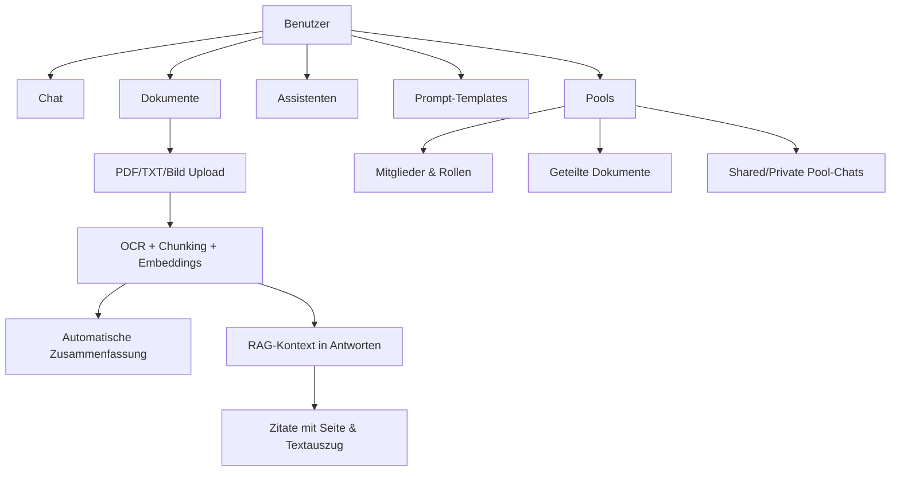
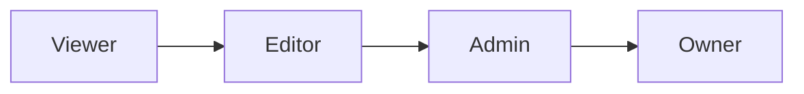
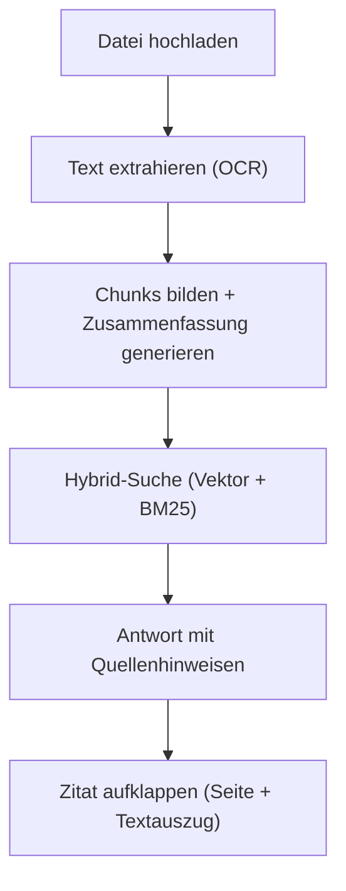
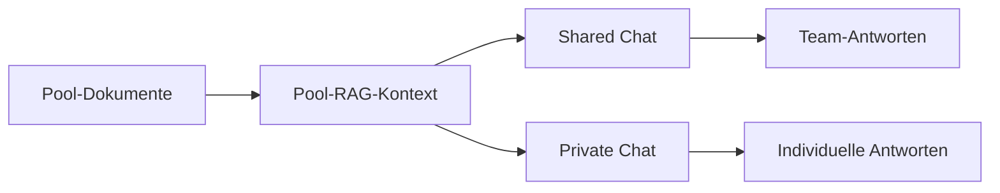

# Anwender-Dokumentation

Stand: 22.02.2026
Produkt: **XQT5 AI Plattform**

## 1. Ziel der Anwendung

Die XQT5 AI Plattform ist ein AI-Workspace für Teams und Einzelnutzer.
Sie kombiniert:

- Multi-LLM-Chat (mehrere KI-Provider)
- Wissensarbeit mit Dokumenten (RAG)
- wiederverwendbare Assistenten und Prompt-Templates
- geteilte Wissensräume ("Pools")

## 2. Funktionsübersicht

## 3. Rollen und Berechtigungen

### 3.1 Plattform-Rollen

- **User**: Chat, eigene Dokumente, eigene Assistenten/Templates, Pools nutzen
- **Admin**: alle User-Rechte plus Admin-Dashboard (Benutzer, Modelle, Provider, Audit)

### 3.2 Pool-Rollen

- **Viewer**: lesen, Fragen stellen
- **Editor**: zusätzlich Dokumente hochladen/löschen
- **Admin**: zusätzlich Mitglieder und Einladungen verwalten
- **Owner**: impliziter Pool-Besitzer, kann Pool löschen

## 4. Hauptbereiche im Alltag

### 4.1 Chat

- Neue Konversation erstellen
- Modell auswählen (z. B. OpenAI, Anthropic, Google, Mistral, xAI, Azure OpenAI)
- Temperatur einstellen
- Streaming-Antworten in Echtzeit
- Auto-Titel für neue Konversationen

### 4.2 Assistenten

- Eigene Assistenten mit:
  - Name, Icon, Beschreibung
  - System-Prompt
  - optionalem Modell-/Temperatur-Override
- Auswahl eines Assistenten startet direkt einen passenden Chat-Kontext

### 4.3 Prompt-Templates

- Wiederverwendbare Prompt-Bausteine
- Kategorien und Beschreibung
- Direkte Einfügung im Nachrichteneingabefeld

### 4.4 Dokumente und RAG

- Upload von **PDF**, **TXT** und **Bildern** (`PNG`, `JPG`, `JPEG`, `WEBP`)
- Automatische Extraktion:
  - PDF via OCR
  - Bilder via OCR
  - TXT via UTF-8-Textimport
- Inhalt wird gechunkt, mit Embeddings indexiert und bei passenden Fragen als Kontext zugespielt
- Hybrid-Suche: Vektorsuche und Volltextsuche (BM25) werden kombiniert für bessere Treffsicherheit
- **Fortschrittsanzeige beim Hochladen**: Ein Fortschrittsbalken zeigt den Upload-Status an (Datei übertragen → OCR-Verarbeitung)
- **Automatische Zusammenfassung**: Nach dem Upload wird automatisch eine kurze Zusammenfassung des Dokuments erstellt und in der Dokumentliste sowie Vorschau angezeigt

#### Quellenhinweise und Zitatmodus

Nach einer RAG-gestützten Antwort werden Quellen angezeigt:

- **Dateiname** der Quelle
- **Seitenzahl** (z. B. "S. 4"), sofern im Dokument vorhanden
- **Aufklappbarer Textauszug** (Zitatmodus): Klick auf die Quelle zeigt den genauen Textabschnitt, aus dem die Antwort stammt

### 4.5 Pools (Geteilte Wissenssammlungen)

- Pool erstellen (Name, Beschreibung, Icon, Farbe)
- Mitglieder per Username hinzufügen
- Invite-Links mit Rolle, Ablaufdatum, Nutzungslimit
- Dokumente poolweit teilen — per **Datei-Upload** oder **Text direkt einfügen** ("Text einfügen"-Button)
- Zwei Chat-Typen:
  - **Shared Chat**: für alle Mitglieder sichtbar
  - **Private Chat**: nur für Ersteller sichtbar, aber gegen Pool-Wissen

**Dokument-Vorschau im Pool:**
- In der Dokumentliste erscheint unter dem Dateinamen automatisch eine kurze Zusammenfassung.
- Der Button **"Vorschau"** öffnet ein Modal mit:
  - Zusammenfassung des Dokuments
  - Textvorschau (PDF/TXT) oder Bildansicht (Bilder)
  - Hinweis bei gekürzten Inhalten
- Vorschau ist für alle Pool-Mitglieder verfügbar (ab Rolle **Viewer**).

## 5. Typische Arbeitsabläufe

### 5.1 Wissensarbeit mit eigenen Dokumenten

1. Neue Konversation starten
2. Relevante Dokumente hochladen (Fortschrittsbalken abwarten)
3. Automatische Zusammenfassung in der Dokumentliste prüfen
4. Frage stellen
5. Antwort inkl. Quellen prüfen — Zitat aufklappen für genauen Textabschnitt und Seitenangabe
6. Optional Assistent/Template ergänzen

### 5.2 Team-Wissensraum mit Pools

1. Pool erstellen
2. Mitglieder einladen (Rolle festlegen)
3. Dokumente in den Pool laden
4. Automatische Zusammenfassungen nutzen, um Inhalte schnell zu überblicken
5. Über **Vorschau** Dokumentinhalt vorab prüfen
6. Shared Chat für gemeinsame Diskussion nutzen
7. Private Chat für persönliche Vertiefung nutzen

## 6. Hinweise für Anwender

- Welche Modelle verfügbar sind, hängt von der Admin-Konfiguration ab.
- Bei deaktivierten Benutzern werden Sessions sofort ungültig.
- Seitenzahlen in Zitaten sind nur bei Dokumenten verfügbar, die nach der letzten Plattform-Aktualisierung hochgeladen oder neu verarbeitet wurden.
- Falls keine automatische Zusammenfassung erscheint oder ein Modell fehlt, bitte den Admin kontaktieren.
