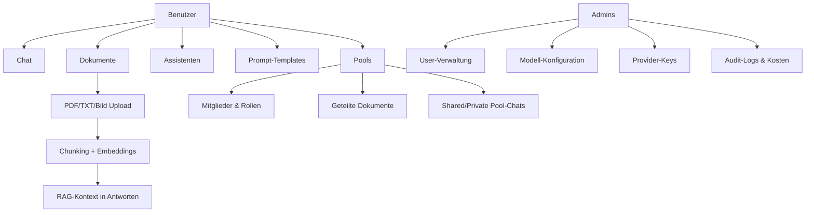
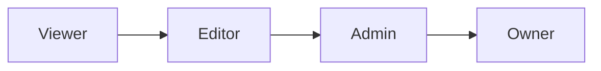
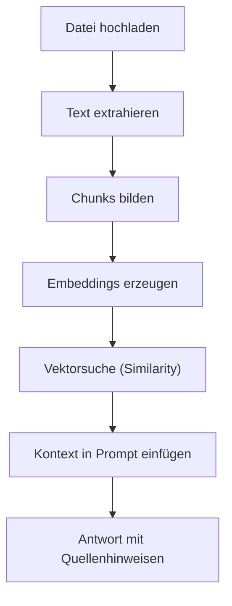
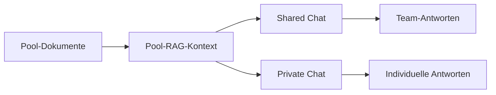
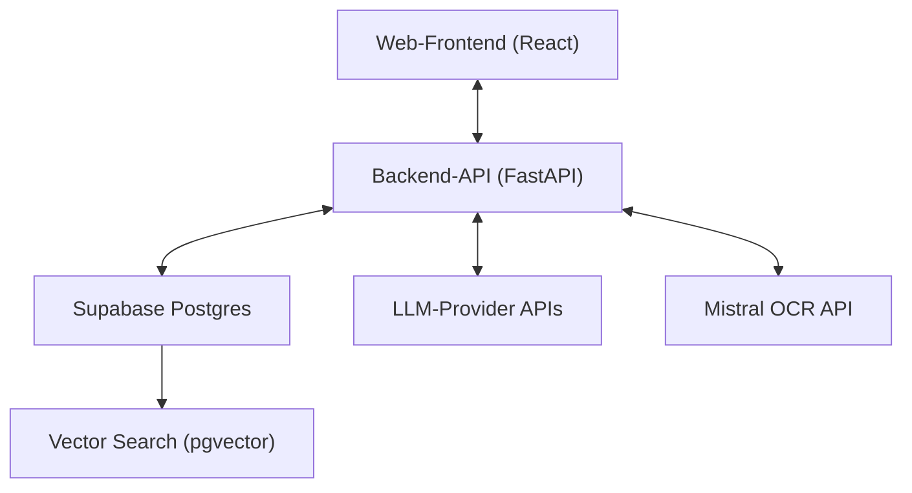

# Anwender-Dokumentation

Stand: 19.02.2026  
Produkt: **XQT5 AI Plattform**

## 1. Ziel der Anwendung

Die XQT5 AI Plattform ist ein AI-Workspace für Teams und Einzelnutzer.  
Sie kombiniert:

- Multi-LLM-Chat (mehrere KI-Provider)
- Wissensarbeit mit Dokumenten (RAG)
- wiederverwendbare Assistenten und Prompt-Templates
- geteilte Wissensräume ("Pools")
- Admin-Funktionen für Governance und Betrieb

## 2. Funktionsübersicht

## 3. Rollen und Berechtigungen

### 3.1 Plattform-Rollen

- **User**: Chat, eigene Dokumente, eigene Assistenten/Templates, Pools nutzen
- **Admin**: alle User-Rechte plus Admin-Dashboard (Benutzer, Modelle, Provider, Audit)

### 3.2 Pool-Rollen

- **Viewer**: lesen, Fragen stellen
- **Editor**: zusätzlich Dokumente hochladen/löschen
- **Admin**: zusätzlich Mitglieder und Einladungen verwalten
- **Owner**: impliziter Pool-Besitzer, kann Pool löschen

## 4. Hauptbereiche im Alltag

### 4.1 Chat

- Neue Konversation erstellen
- Modell auswählen (z. B. OpenAI, Anthropic, Google, Mistral, xAI, Azure OpenAI)
- Temperatur einstellen
- Streaming-Antworten in Echtzeit
- Auto-Titel für neue Konversationen

### 4.2 Assistenten

- Eigene Assistenten mit:
  - Name, Icon, Beschreibung
  - System-Prompt
  - optionalem Modell-/Temperatur-Override
- Auswahl eines Assistenten startet direkt einen passenden Chat-Kontext

### 4.3 Prompt-Templates

- Wiederverwendbare Prompt-Bausteine
- Kategorien und Beschreibung
- Direkte Einfügung im Nachrichteneingabefeld

### 4.4 Dokumente und RAG

- Upload von **PDF**, **TXT** und **Bildern** (`PNG`, `JPG`, `JPEG`, `WEBP`)
- Automatische Extraktion:
  - PDF via Mistral OCR
  - Bilder via Mistral OCR
  - TXT via UTF-8-Textimport
- Inhalt wird gechunkt, mit Embeddings indexiert und bei passenden Fragen als Kontext zugespielt
- Quellenhinweise werden bei Antworten angezeigt

### 4.5 Pools (Geteilte Wissenssammlungen)

- Pool erstellen (Name, Beschreibung, Icon, Farbe)
- Mitglieder per Username hinzufügen
- Invite-Links mit Rolle, Ablaufdatum, Nutzungslimit
- Dokumente poolweit teilen
- Dokumentvorschau direkt im Pool (Textvorschau, bei Bildern inkl. Bildansicht)
- Zwei Chat-Typen:
  - **Shared Chat**: für alle Mitglieder sichtbar
  - **Private Chat**: nur für Ersteller sichtbar, aber gegen Pool-Wissen

**PoolsViewer (aktueller Stand):**
- In der Pool-Dokumentliste gibt es pro Dokument den Button **"Vorschau"**.
- Vorschau ist für alle Pool-Mitglieder verfügbar (ab Rolle **Viewer**).
- Die Vorschau öffnet sich als Modal über dem Dokument-Tab.
- Bei PDF/TXT wird eine Textvorschau angezeigt.
- Bei Bild-Dokumenten wird eine Bildansicht angezeigt; falls OCR/Text vorhanden ist, zusätzlich Text.
- Lange Inhalte werden in der Vorschau gekürzt und als gekürzt gekennzeichnet.

### 4.6 Admin-Dashboard

- Benutzer aktivieren/deaktivieren, Admin-Rechte steuern
- Nutzungs- und Kostenauswertung
- Systemstatistiken
- Modellkatalog (aktiv/deaktiviert, Default-Modell)
- Provider-Keys speichern, testen, entfernen
- Audit-Logs für Nachvollziehbarkeit

## 5. Typische Arbeitsabläufe

### 5.1 Wissenschat mit eigenen Dokumenten

1. Neue Konversation starten
2. Relevante Dokumente hochladen
3. Frage stellen
4. Antwort inkl. Quellen prüfen
5. Optional Assistent/Template ergänzen

### 5.2 Team-Wissensraum mit Pools

1. Pool erstellen
2. Mitglieder einladen (Rolle festlegen)
3. Dokumente in den Pool laden
4. Über **Vorschau** Dokumentinhalt vorab prüfen
5. Shared Chat für gemeinsame Diskussion nutzen
6. Private Chat für persönliche Vertiefung nutzen

### 5.3 Governance durch Admin

1. Modelle und Provider-Schlüssel konfigurieren
2. Zugriff und Rollen kontrollieren
3. Nutzungskosten überwachen
4. Auffälligkeiten über Audit-Logs prüfen

## 6. Schematische Architektur (Anwendersicht)

## 7. Aktueller Entwicklungsstand

Umgesetzt:

- Chat, Auth, Usage-Tracking
- Assistenten und Templates
- Dokument-Upload + RAG + Quellenhinweise
- Admin-Dashboard mit Audit/Provider/Modellen
- Pools mit Rollen, Invite-Links, Shared/Private Chats
- Pool-Dokumentvorschau (Text/Bild) im Dokument-Tab

Noch geplant:

- Workflow-Engine (Automatisierungen)
- SSO (OIDC/SAML)

## 8. Hinweise für Anwender

- Für Embeddings/RAG wird ein konfigurierter OpenAI-Key benötigt.
- Für OCR gescannter PDFs wird ein konfigurierter Mistral-Key benötigt.
- Modellverfügbarkeit hängt von aktivierten Provider-Keys und Admin-Konfiguration ab.
- Bei deaktivierten Benutzern werden Sessions sofort ungültig.
