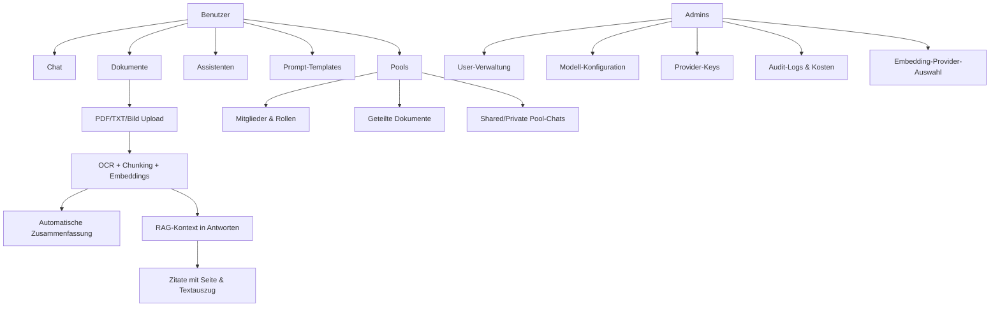
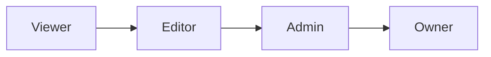
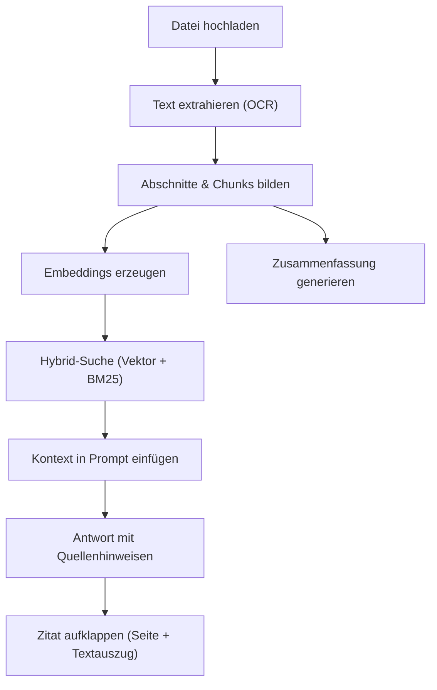
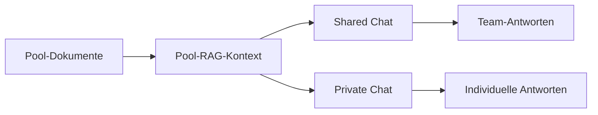
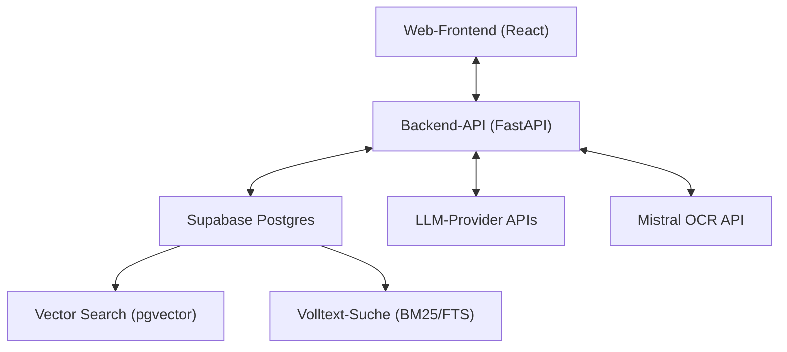

# Anwender-Dokumentation

Stand: 22.02.2026
Produkt: **XQT5 AI Plattform**

## 1. Ziel der Anwendung

Die XQT5 AI Plattform ist ein AI-Workspace für Teams und Einzelnutzer.
Sie kombiniert:

- Multi-LLM-Chat (mehrere KI-Provider)
- Wissensarbeit mit Dokumenten (RAG)
- wiederverwendbare Assistenten und Prompt-Templates
- geteilte Wissensräume ("Pools")
- Admin-Funktionen für Governance und Betrieb

## 2. Funktionsübersicht

## 3. Rollen und Berechtigungen

### 3.1 Plattform-Rollen

- **User**: Chat, eigene Dokumente, eigene Assistenten/Templates, Pools nutzen
- **Admin**: alle User-Rechte plus Admin-Dashboard (Benutzer, Modelle, Provider, Audit)

### 3.2 Pool-Rollen

- **Viewer**: lesen, Fragen stellen
- **Editor**: zusätzlich Dokumente hochladen/löschen
- **Admin**: zusätzlich Mitglieder und Einladungen verwalten
- **Owner**: impliziter Pool-Besitzer, kann Pool löschen

## 4. Hauptbereiche im Alltag

### 4.1 Chat

- Neue Konversation erstellen
- Modell auswählen (z. B. OpenAI, Anthropic, Google, Mistral, xAI, Azure OpenAI)
- Temperatur einstellen
- Streaming-Antworten in Echtzeit
- Auto-Titel für neue Konversationen

### 4.2 Assistenten

- Eigene Assistenten mit:
  - Name, Icon, Beschreibung
  - System-Prompt
  - optionalem Modell-/Temperatur-Override
- Auswahl eines Assistenten startet direkt einen passenden Chat-Kontext

### 4.3 Prompt-Templates

- Wiederverwendbare Prompt-Bausteine
- Kategorien und Beschreibung
- Direkte Einfügung im Nachrichteneingabefeld

### 4.4 Dokumente und RAG

- Upload von **PDF**, **TXT** und **Bildern** (`PNG`, `JPG`, `JPEG`, `WEBP`)
- Automatische Extraktion:
  - PDF via Mistral OCR
  - Bilder via Mistral OCR
  - TXT via UTF-8-Textimport
- Inhalt wird gechunkt (abschnittsweise mit Kontext-Header), mit Embeddings indexiert und bei passenden Fragen als Kontext zugespielt
- Hybrid-Suche: Vektorsuche und Volltextsuche (BM25) werden kombiniert für bessere Treffsicherheit
- **Fortschrittsanzeige beim Hochladen**: Ein Fortschrittsbalken zeigt den Upload-Status an (Datei übertragen → OCR-Verarbeitung)
- **Automatische Zusammenfassung**: Nach dem Upload wird automatisch eine 2–3-satzige Zusammenfassung des Dokuments erstellt und in der Dokumentliste sowie Vorschau angezeigt

#### Quellenhinweise und Zitatmodus

Nach einer RAG-gestützten Antwort werden Quellen mit folgenden Informationen angezeigt:

- **Dateiname** der Quelle
- **Seitenzahl** (falls im Dokument vorhanden, z. B. "S. 4")
- **Aufklappbarer Textauszug** (Zitatmodus): Klick auf die Quelle zeigt den genauen Textabschnitt, aus dem die Antwort stammt

### 4.5 Pools (Geteilte Wissenssammlungen)

- Pool erstellen (Name, Beschreibung, Icon, Farbe)
- Mitglieder per Username hinzufügen
- Invite-Links mit Rolle, Ablaufdatum, Nutzungslimit
- Dokumente poolweit teilen — per **Datei-Upload** oder **Text direkt einfügen** ("Text einfügen"-Button)
- Dokumentvorschau direkt im Pool (Textvorschau, bei Bildern inkl. Bildansicht, inkl. automatischer Zusammenfassung)
- Zwei Chat-Typen:
  - **Shared Chat**: für alle Mitglieder sichtbar
  - **Private Chat**: nur für Ersteller sichtbar, aber gegen Pool-Wissen

**Dokument-Vorschau im Pool:**
- In der Pool-Dokumentliste wird unter dem Dateinamen eine kurze automatische Zusammenfassung angezeigt.
- Der Button **"Vorschau"** öffnet ein Modal mit:
  - Zusammenfassung des Dokuments
  - Textvorschau (PDF/TXT) oder Bildansicht (Bilder)
  - Hinweis bei gekürzten Inhalten
- Vorschau ist für alle Pool-Mitglieder verfügbar (ab Rolle **Viewer**).

### 4.6 Admin-Dashboard

- Benutzer aktivieren/deaktivieren, Admin-Rechte steuern
- Nutzungs- und Kostenauswertung (aufgeschlüsselt nach Modell und Provider)
- Systemstatistiken
- Modellkatalog (aktiv/deaktiviert, Default-Modell)
- Provider-Keys speichern, testen, entfernen
- Audit-Logs für Nachvollziehbarkeit
- **Embedding-Provider-Auswahl**: Im Retrieval-Tab kann zwischen OpenAI und Azure OpenAI als Embedding-Provider gewählt werden. Bei Azure OpenAI ist zusätzlich der Deployment-Name einzutragen.
- **Dokumente neu chunken**: Alle hochgeladenen Dokumente mit aktueller Chunking-Strategie neu verarbeiten (Retrieval-Tab im Admin-Dashboard)

## 5. Typische Arbeitsabläufe

### 5.1 Wissensarbeit mit eigenen Dokumenten

1. Neue Konversation starten
2. Relevante Dokumente hochladen (Fortschrittsbalken abwarten)
3. Automatische Zusammenfassung in der Dokumentliste prüfen
4. Frage stellen
5. Antwort inkl. Quellen prüfen — Zitat aufklappen für genauen Textabschnitt und Seitenangabe
6. Optional Assistent/Template ergänzen

### 5.2 Team-Wissensraum mit Pools

1. Pool erstellen
2. Mitglieder einladen (Rolle festlegen)
3. Dokumente in den Pool laden
4. Automatische Zusammenfassungen in der Dokumentliste nutzen, um Inhalte schnell zu überblicken
5. Über **Vorschau** Dokumentinhalt vorab prüfen
6. Shared Chat für gemeinsame Diskussion nutzen
7. Private Chat für persönliche Vertiefung nutzen

### 5.3 Governance durch Admin

1. Modelle und Provider-Schlüssel konfigurieren
2. Embedding-Provider festlegen (OpenAI oder Azure OpenAI)
3. Zugriff und Rollen kontrollieren
4. Nutzungskosten überwachen (aufgeschlüsselt nach Modell und Provider)
5. Auffälligkeiten über Audit-Logs prüfen

## 6. Schematische Architektur (Anwendersicht)

## 7. Aktueller Entwicklungsstand

Umgesetzt:

- Chat, Auth, Usage-Tracking
- Assistenten und Templates
- Dokument-Upload + RAG + Quellenhinweise
- Admin-Dashboard mit Audit/Provider/Modellen
- Pools mit Rollen, Invite-Links, Shared/Private Chats, Text-Einfügen
- Pool-Dokumentvorschau (Text/Bild) im Dokument-Tab
- Verbesserte RAG-Suche: abschnittsbasiertes Chunking mit Kontext-Headern, Hybrid-Suche (Vektor + BM25)
- Upload-Fortschrittsbalken (Datei-Transfer + OCR-Verarbeitung)
- Sidebar: anpassbare Aufteilung zwischen Pools und Konversationen (Drag-to-Resize)
- **Zitatmodus**: aufklappbare Textauszüge pro Quelle in RAG-Antworten
- **Seitenzahlen in Zitaten**: Quellenhinweise zeigen die Seitenzahl im Originaldokument
- **Embedding-Provider-Auswahl**: Admin kann OpenAI oder Azure OpenAI als Embedding-Provider wählen
- **Automatische Zusammenfassung**: Dokumente erhalten nach dem Upload automatisch eine KI-generierte Zusammenfassung

Noch geplant:

- Mehrere Pools zusammenschalten für übergreifendes Retrieval
- Word-Dokumente (.docx) und weitere Formate verarbeiten
- Nextcloud-Anbindung für Dokumentimport
- Workflow-Engine (Automatisierungen)
- SSO (OIDC/SAML)

## 8. Hinweise für Anwender

- Für Embeddings/RAG wird ein konfigurierter OpenAI- oder Azure-OpenAI-Key benötigt (je nach Admin-Einstellung im Retrieval-Tab).
- Für OCR gescannter PDFs wird ein konfigurierter Mistral-Key benötigt.
- Für die automatische Dokumentzusammenfassung wird das konfigurierte Standard-Modell genutzt.
- Modellverfügbarkeit hängt von aktivierten Provider-Keys und Admin-Konfiguration ab.
- Bei deaktivierten Benutzern werden Sessions sofort ungültig.
- Seitenzahlen in Zitaten sind nur bei Dokumenten verfügbar, die nach der entsprechenden Migration neu hochgeladen oder neu gechunkt wurden.
