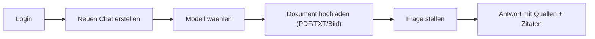
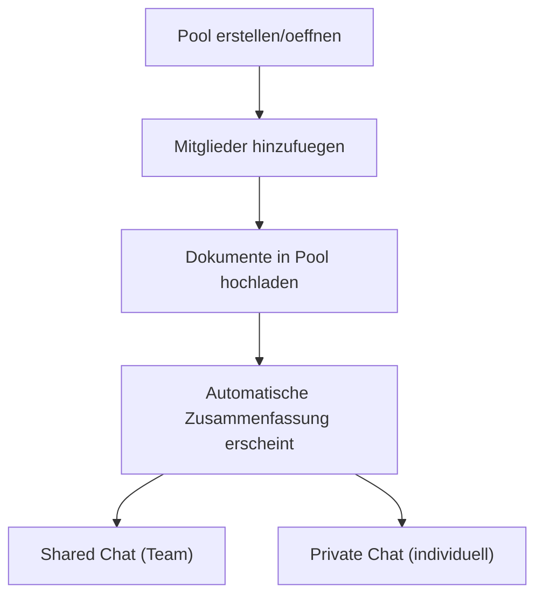

# Anwender Quickstart

Stand: 22.02.2026
Produkt: **XQT5 AI Plattform**

## 1. Ziel in 5 Minuten

Nach diesem Quickstart kannst du:

1. dich anmelden
2. einen Chat starten
3. ein Dokument hochladen
4. eine RAG-gestuetzte Antwort mit Quellen erhalten
5. optional in einem Pool mit anderen zusammenarbeiten

## 2. Schnellueberblick

## 3. Schritt-fuer-Schritt

### Schritt 1: Einloggen

1. Oeffne die Plattform im Browser.
2. Melde dich mit Benutzername und Passwort an.
3. Falls noetig: registriere zuerst einen neuen Account.

### Schritt 2: Neuen Chat starten

1. Klicke auf "New Conversation".
2. Waehle ein Modell im Dropdown.
3. Stelle optional die Temperatur ein:
   - niedriger = praeziser/konstanter
   - hoeher = kreativer/variabler

### Schritt 3: Dokument hinzufuegen (RAG)

1. Lade eine Datei hoch (`.pdf`, `.txt`, `.png`, `.jpg`, `.jpeg`, `.webp`).
2. Ein Fortschrittsbalken zeigt den Upload-Status an (zuerst Datei-Transfer, dann OCR-Verarbeitung).
3. Nach der Verarbeitung erscheint unter dem Dateinamen automatisch eine kurze Zusammenfassung des Inhalts.
4. Warte bis der Status "ready" angezeigt wird.
5. Stelle dann eine konkrete Frage zum Inhalt.

Beispiel:
- "Fasse Kapitel 3 in 5 Stichpunkten zusammen."
- "Welche Risiken werden im Dokument genannt?"

### Schritt 4: Antwort pruefen

1. Pruefe die Antwort.
2. Unter der Antwort werden Quellen angezeigt — mit Dateiname und Seitenzahl (z. B. "Bericht.pdf (S. 4)").
3. Klicke auf eine Quelle, um den genauen Textauszug aufzuklappen (Zitatmodus).
4. Verfeinere die Frage bei Bedarf (z. B. engeren Fokus setzen).

## 4. Optional: Mit Assistenten schneller arbeiten

Assistenten sind vorkonfigurierte Rollen mit eigenem System-Prompt.

Typischer Ablauf:
1. Assistent waehlen
2. Chat startet mit passendem Kontext
3. Fragen wie gewohnt stellen

## 5. Optional: Prompt-Templates nutzen

Templates sind wiederverwendbare Prompt-Bausteine.

Typischer Ablauf:
1. Template im Eingabebereich waehlen
2. Text einfuegen lassen
3. Felder/Inhalte anpassen und senden

## 6. Optional: Teamarbeit mit Pools

Pools sind geteilte Wissensraeume mit Rollen.

Pool-Rollen:
- Viewer: lesen + fragen
- Editor: zusaetzlich Dokumente verwalten (Datei-Upload oder Text einfuegen)
- Admin: zusaetzlich Mitglieder/Einladungen verwalten
- Owner: Pool-Besitzer

Tipp: Statt eine Datei hochzuladen kannst du im Pool-Dokumenttab auch direkt Text einfuegen
("Text einfuegen"-Button). Der Text wird genauso verarbeitet wie eine hochgeladene Datei.

Dokument-Vorschau im Pool:
1. Oeffne im Pool den Tab "Dokumente".
2. In der Dokumentliste siehst du unter jedem Dateinamen die automatische Zusammenfassung.
3. Klicke bei einem Dokument auf "Vorschau".
4. Im Modal siehst du:
   - Zusammenfassung des Dokuments
   - bei PDF/TXT: Textvorschau
   - bei Bildern: Bildansicht (plus ggf. Text)
5. Bei sehr langen Inhalten wird die Vorschau gekuerzt angezeigt.

## 7. Wenn etwas nicht funktioniert

- Kein Modell sichtbar:
  - Admin muss Modell/Provider aktivieren.
- Dokumentverarbeitung schlaegt fehl:
  - Dateityp pruefen (`PDF/TXT/Bild`), Datei ggf. kleiner machen.
- Keine Quellen bei Antwort:
  - pruefen, ob Dokumentstatus "ready" ist.
- Keine Seitenzahl in Zitaten:
  - Dokument muss nach der aktuellen Migration hochgeladen oder neu gechunkt worden sein.
- Keine automatische Zusammenfassung:
  - Zusammenfassung erfordert ein konfiguriertes Standard-Modell; ggf. Admin kontaktieren.
- Keine/zu kurze Vorschau im Pool:
  - Vorschau zeigt Textauszug; bei sehr langen Dokumenten ist sie gekuerzt.
- Login/Session bricht ab:
  - ggf. neu einloggen (Token wurde evtl. invalidiert).

## 8. Empfohlener Standard-Workflow

1. Chat erstellen
2. Relevante Dokumente hochladen (Zusammenfassung pruefen)
3. Frage mit klarem Ziel stellen
4. Quellen und Zitate pruefen
5. Ergebnis iterativ verfeinern

Damit erreichst du in der Regel die beste Balance aus Geschwindigkeit und Qualitaet.
