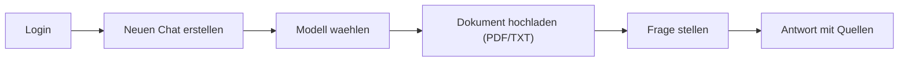
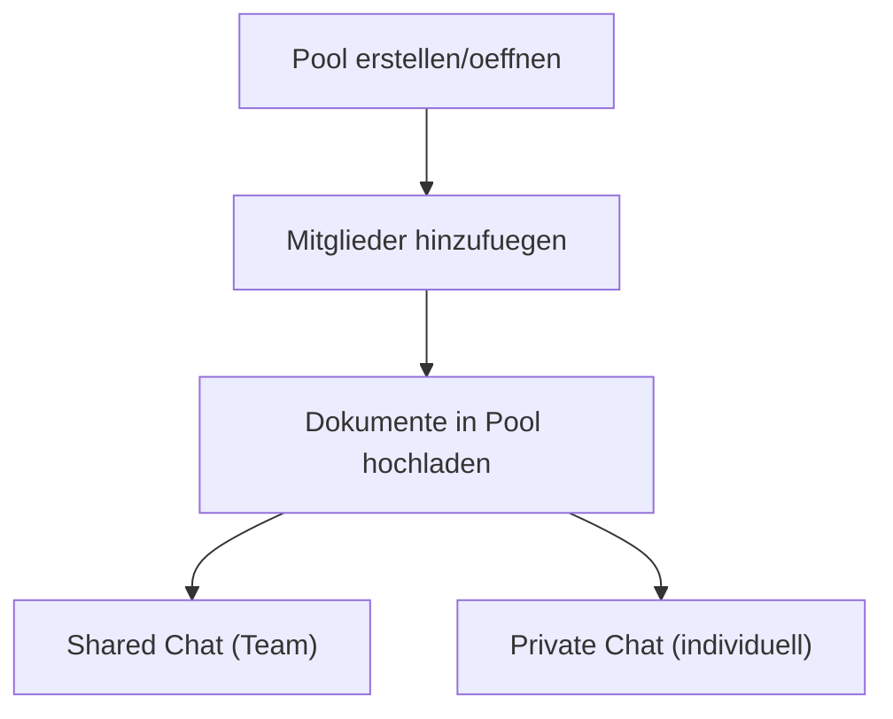

# Anwender Quickstart

Stand: 18.02.2026  
Produkt: **XQT5 AI Plattform**

## 1. Ziel in 5 Minuten

Nach diesem Quickstart kannst du:

1. dich anmelden
2. einen Chat starten
3. ein Dokument hochladen
4. eine RAG-gestuetzte Antwort mit Quellen erhalten
5. optional in einem Pool mit anderen zusammenarbeiten

## 2. Schnellueberblick

## 3. Schritt-fuer-Schritt

### Schritt 1: Einloggen

1. Oeffne die Plattform im Browser.
2. Melde dich mit Benutzername und Passwort an.
3. Falls noetig: registriere zuerst einen neuen Account.

### Schritt 2: Neuen Chat starten

1. Klicke auf "New Conversation".
2. Waehle ein Modell im Dropdown.
3. Stelle optional die Temperatur ein:
   - niedriger = praeziser/konstanter
   - hoeher = kreativer/variabler

### Schritt 3: Dokument hinzufuegen (RAG)

1. Lade eine Datei hoch (`.pdf` oder `.txt`).
2. Warte bis der Status verarbeitet ist.
3. Stelle dann eine konkrete Frage zum Inhalt.

Beispiel:
- "Fasse Kapitel 3 in 5 Stichpunkten zusammen."
- "Welche Risiken werden im Dokument genannt?"

### Schritt 4: Antwort pruefen

1. Pruefe die Antwort.
2. Nutze die angezeigten Quellenhinweise fuer Nachvollziehbarkeit.
3. Verfeinere die Frage bei Bedarf (z. B. engeren Fokus setzen).

## 4. Optional: Mit Assistenten schneller arbeiten

Assistenten sind vorkonfigurierte Rollen mit eigenem System-Prompt.

Typischer Ablauf:
1. Assistent waehlen
2. Chat startet mit passendem Kontext
3. Fragen wie gewohnt stellen

## 5. Optional: Prompt-Templates nutzen

Templates sind wiederverwendbare Prompt-Bausteine.

Typischer Ablauf:
1. Template im Eingabebereich waehlen
2. Text einfuegen lassen
3. Felder/Inhalte anpassen und senden

## 6. Optional: Teamarbeit mit Pools

Pools sind geteilte Wissensraeume mit Rollen.

Pool-Rollen:
- Viewer: lesen + fragen
- Editor: zusaetzlich Dokumente verwalten
- Admin: zusaetzlich Mitglieder/Einladungen verwalten
- Owner: Pool-Besitzer

## 7. Wenn etwas nicht funktioniert

- Kein Modell sichtbar:
  - Admin muss Modell/Provider aktivieren.
- Dokumentverarbeitung schlaegt fehl:
  - Dateityp pruefen (`PDF/TXT`), Datei ggf. kleiner machen.
- Keine Quellen bei Antwort:
  - pruefen, ob Dokumentstatus "ready" ist.
- Login/Session bricht ab:
  - ggf. neu einloggen (Token wurde evtl. invalidiert).

## 8. Empfohlener Standard-Workflow

1. Chat erstellen
2. Relevante Dokumente hochladen
3. Frage mit klarem Ziel stellen
4. Quellen pruefen
5. Ergebnis iterativ verfeinern

Damit erreichst du in der Regel die beste Balance aus Geschwindigkeit und Qualitaet.
